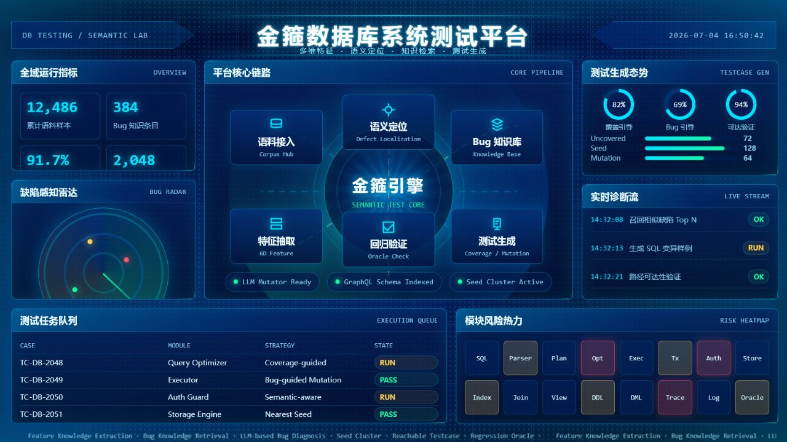

# 金箍

金箍是一个面向数据库管理系统测试的多 Agent 平台。项目围绕代码覆盖率提升、SQL 测试生成、语义缺陷定位和测试过程可视化展开，目标是在已有种子、覆盖率反馈、代码上下文和大模型推理之间形成闭环。

## 平台预览



## 核心能力

- 多 Agent 协作：由覆盖率分析、SQL 测试、代码探索和调度协调等 Agent 共同完成测试任务。
- 先试后查策略：优先基于最近种子快速生成测试；覆盖率未提升时，再进入代码上下文和调用关系分析。
- 覆盖率驱动测试：通过覆盖率结果反向指导下一轮 SQL seed 选择、变异和验证。
- 语义缺陷定位：围绕语料、特征抽取、Bug 知识库、语义定位和回归验证构建测试平台链路。
- 可视化展示：提供金箍数据库系统测试平台大屏，用于汇报和展示平台整体流程。

## 系统组成

```text
金箍
├── code-coverage-multi-agent/
│   ├── langgraph/
│   │   ├── coverage_multi_agent.py
│   │   └── nodes/
│   │       ├── collect_coverage.py
│   │       ├── search_nearest_seed.py
│   │       ├── run_sql_test.py
│   │       ├── get_code_context.py
│   │       └── traverse_call_graph.py
│   ├── batch_test_functions.py
│   ├── dcosd_workflow_ui.html
│   ├── jinggu-db-test-platform.html
│   ├── assets/
│   │   └── jinggu-db-test-platform.png
│   ├── README.md
│   └── requirements.txt
├── test_agent_github.tar.gz
└── README.md
```

## Agent 工作流

平台采用两阶段测试策略：

```text
阶段一：快速尝试
Supervisor
  -> Coverage Analyzer
  -> Collect_Coverage
  -> Search_Nearest_Seed
  -> 生成 SQL 测试用例
  -> SQL Tester
  -> Run_SQL_Test
  -> Collect_Coverage

阶段二：深入分析
覆盖率未提升
  -> Code Explorer
  -> Get_Code_Context
  -> Traverse_Call_Graph
  -> Coverage Analyzer
  -> 生成更精确 SQL
  -> SQL Tester
  -> 回归验证
```

## 可视化页面

项目包含两个静态可视化页面：

- `code-coverage-multi-agent/dcosd_workflow_ui.html`：Agent 执行流程演示页面。
- `code-coverage-multi-agent/jinggu-db-test-platform.html`：金箍数据库系统测试平台大屏。

大屏页面为纯静态 HTML，可以直接用浏览器打开，不需要额外构建步骤。

## 快速开始

进入多 Agent 子项目：

```bash
cd code-coverage-multi-agent
```

安装依赖：

```bash
pip install -r requirements.txt
```

运行单个函数测试：

```python
from langgraph.coverage_multi_agent import run_test

result = run_test("dcosd")
print(result)
```

批量测试：

```bash
python batch_test_functions.py --start-index 0 --end-index 10
```

## 环境依赖

运行测试 Agent 前，需要准备：

- Python 运行环境
- PostgreSQL 数据库连接
- Neo4j 数据库连接，用于调用关系分析
- LLM 服务，可使用 Ollama 或兼容 OpenAI API 的模型服务

## 主要文档

- `code-coverage-multi-agent/README.md`：多 Agent 子系统说明。
- `code-coverage-multi-agent/INSTALL.md`：安装说明。
- `code-coverage-multi-agent/CORRECT_AGENT_WORKFLOW.md`：正确工作流程说明。
- `code-coverage-multi-agent/AGENT_ARCHITECTURE_AND_WORKFLOW.md`：Agent 架构与交互说明。
- `code-coverage-multi-agent/DCOSD_FUNCTION_CORRECT_WORKFLOW.md`：dcosd 示例工作流。

## 适用场景

- 数据库系统函数级覆盖率提升实验
- SQL seed 检索和测试用例生成
- 代码上下文辅助的测试生成
- 多 Agent 测试流程展示
- 数据库系统测试平台汇报大屏
